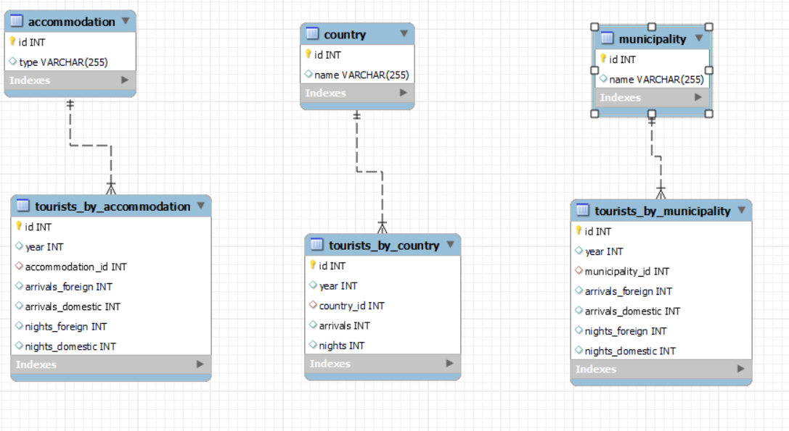
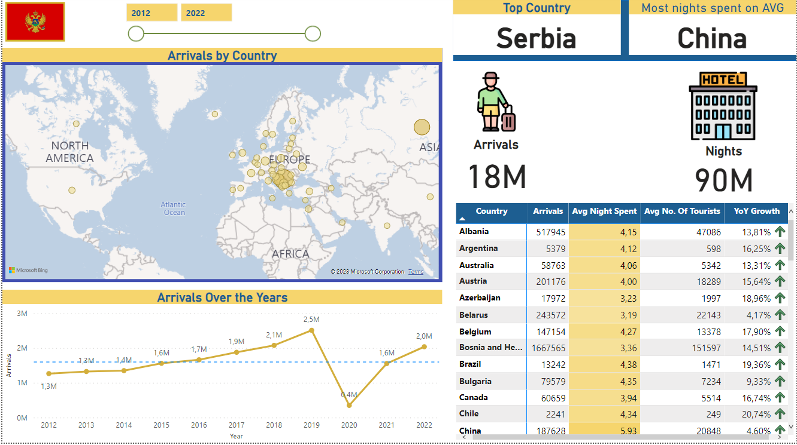

# Tourism Analysis in Montenegro 2012-2022
## Introduction

This project aims to analyze the tourism industry in Montenegro from 2012 to 2022. The data used in this analysis was obtained from the Montenegrin Agency for Statistics (MONSTAT), which provides annual data on the number of tourists visiting Montenegro and their country of origin, type of accommodation, and municipality they visited.
## Data Cleaning and Preparation

The original data was provided in Excel files for every year, which were extracted and processed in Python using the pandas library. The data was cleaned and three tables were extracted: tourists by accommodation, tourists by country, and tourists by municipality for every year. The data was then loaded into a MySQL database using Python and pymysql, and further cleaned and standardized.
Analysis

Once the data was stored in the MySQL database, we performed initial analysis using SQL queries to gain insights into the tourism industry in Montenegro. We also created a dashboard in Power BI to visualize the data and gain a better understanding of the trends and patterns.

## MySQL Analysis

After storing the data in a MySQL database, various advanced SQL techniques were utilized to perform a comprehensive analysis of the tourism industry in Montenegro. To accomplish this task, a combination of views, temporary tables, common table expressions (CTEs), and window functions were employed.

The SQL queries used for the analysis were carefully crafted to extract valuable insights from the data. For instance, CTEs and window functions were utilized to calculate growth rates and average growth rates for municipalities. In addition to these techniques, views and temporary tables were employed to simplify complex queries and avoid repetitive calculations.

The queries used in the analysis were designed to uncover trends and patterns in the tourism industry over the past decade.
By utilizing these advanced SQL techniques, a comprehensive and detailed analysis of the tourism industry in Montenegro was performed, revealing valuable insights that can inform future decision-making processes.
 
### Database Schema  

## Power Bi Dashboard

In addition to the MySQL analysis, a dashboard was created in Power BI to further visualize and gain insights from the data. To create the Power BI report, the MySQL database was connected to Power BI and the tables were linked by year. Measures were created to calculate year-over-year growth rates, and a variety of visualizations were used to display the data, such as bar charts, line charts, and maps.

The Power BI report allowed for an interactive and user-friendly way to explore the data, enabling users to filter by year, municipality, country, and accommodation type. The report provided an overview of the tourism industry in Montenegro over the past decade, highlighting trends and patterns that were not immediately apparent through the MySQL analysis alone.

Overall, the combination of MySQL analysis and Power BI visualization provided a comprehensive understanding of the tourism industry in Montenegro, revealing valuable insights that can inform future decision-making processes. 
 
### Country Analysis  

## Files

1. Python script used to extract data from the Excel files and to clean and standardize the data:
      * `2017-2022.ipynb`, `2016.ipynb`, `2015.ipynb`, `2014.ipynb`, `2013.ipynb`, `2012.ipynb`
 2. Python script used to import data into the MySQL database:
      * `Creating and inserting data into MYSQL Workbench.ipynb`
3. SQL queries used for initial analysis:
      * `tourists_by_accommodation.sql`, `tourists_by_country_analysis.sql`, `tourists_by_municipality_analysis.sql`
4. Power BI file containing the dashboard:
      * `Dashboard.pbix`

## Technologies Used

In this project, I utilized various technologies to perform data extraction, transformation, and analysis. Some of the key technologies I used include:
* MySQL: I used MySQL as the primary database to store the cleaned and standardized data. With MySQL, I was able to efficiently manage and query the data to perform initial analysis.
* Pandas: I leveraged Pandas, a popular data manipulation library in Python, to extract and clean data from the raw Excel files. I also used Pandas to transform the data into the necessary formats for loading into MySQL.
* Python: Python was the primary programming language I used in this project. I used it to create data pipelines and perform data processing tasks.
* Power BI: I utilized Power BI to create an interactive dashboard for visualizing the data in a user-friendly way.

## Conclusion

The analysis of the tourism industry in Montenegro from 2012 to 2022 reveals a steady upward trend in the number of tourists visiting the country each year, with a peak in 2019. However, due to the COVID-19 pandemic in 2020, there was a significant dip in the number of tourists.The majority of tourists are from neighboring countries, with Serbia being the top country of origin. Most tourists stay in hotels or private accommodation, and the coastal municipalities are the most popular tourist destinations.

## Future Work

There are many potential directions for future work in this project, including exploring the impact of the COVID-19 pandemic on the tourism industry in Montenegro, analyzing the economic impact of tourism, and comparing Montenegro's tourism industry to those of other countries in the region.

